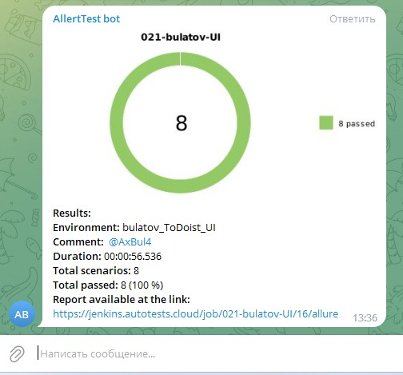

## Учебный проект по автоматизации тестирования (Web UI)
<a name="Ссылка"></a>
### Веб сайт <a target="_blank" href="https://todoist.com/">todoist.com</a>

<p align="center">

</p>

## :maple_leaf: Содержание:

- Технологии и инструменты
- Список проверок, реализованных в тестах
- Запуск тестов (сборка в Jenkins)
- Allure-отчет
- Интеграция с Allure TestOps
- Интеграция с Atlassian Jira
- Уведомление в Telegram о результатах прогона тестов
- Видео пример прохождения тестов

## :maple_leaf: Технологии и инструменты

<p align="center">
<a href="https://www.jetbrains.com/idea/"></a>
<a href="https://www.java.com/"></a>
<a href="https://github.com/"></a>
<a href="https://junit.org/junit5/"></a>
<a href="https://gradle.org/"></a>
<a href="https://selenide.org/"></a>
<a href="https://aerokube.com/selenoid/"></a>
<a href="https://github.com/allure-framework/allure2"></a>
<a href="https://qameta.io/"></a>
<a href="https://www.atlassian.com/ru/software/jira"></a>
<a href="https://www.jenkins.io/"></a>
</p>

## :maple_leaf: Список проверок, реализованных в автотестах

- [x] Проверка загрузки главной станицы
- [x] Проверка наличия элементов меню на главной станице
- [x] Проверка кликабельности элементов меню на главной станице
- [x] Проверка авторизации пользователя с валидными данными логина и пароля
- [x] Проверка кликабельности элементов меню на странице авторизации станице
- [x] Проверка авторизации пользователя с пустыми полями логина и пароля


## :maple_leaf: Список проверок, реализованных в ручных тестах

- [x] Проверка отображения стоимости тарифов на странице Тарифы 
- [x] Проверка выбора валюты оплаты на странице Тарифы

## :maple_leaf: Запуск тестов

###  Локальный запуск :
Пример командной строки:
```bash
gradle clean test -Denv=remote
gradle clean test -Denv=local
```
Получение отчёта:
```bash
allure serve build/allure-results
```

###  Удаленный запуск (в Jenkins):
1. Открыть <a target="_blank" href="https://jenkins.autotests.cloud/job/021-bulatov-UI/">проект</a>


2. Выбрать пункт **Собрать с параметрами**
3. В случае необходимости изменить параметры, выбрав значения из выпадающих списков
4. Нажать **Собрать**
5. Результат запуска сборки можно посмотреть в отчёте Allure


## </a> Отчет в <a target="_blank" href="https://jenkins.autotests.cloud/job/021-bulatov-UI/16/allure/">Allure report</a>

###  Главное окно

<p align="center">

</p>

###  Тесты

<p align="center">

</p>

###  Графики

<p align="center">

</p>


## </a> Интеграция с <a target="_blank" href="https://allure.autotests.cloud/launch/20672">Allure TestOps</a>
### Общий список всех кейсов: ручных и авто
<p align="center">

</p>

### Dashboard с общими результатами тестирования
<p align="center">

</p>

### Пример отчёта выполнения одного из автотестов
<p align="center">

</p>

## </a> Интеграция с <a target="_blank" href="https://jira.autotests.cloud/browse/HOMEWORK-600">Atlassian Jira</a>
<p align="center">

</p>

## </a> Уведомление в Telegram о результатах прогона тестов

<p align="center">

</p>

## </a> Видео прохождения тестов
<p align="center">
</a>
</p>

[Вернуться к оглавлению ⬆](#Ссылка)